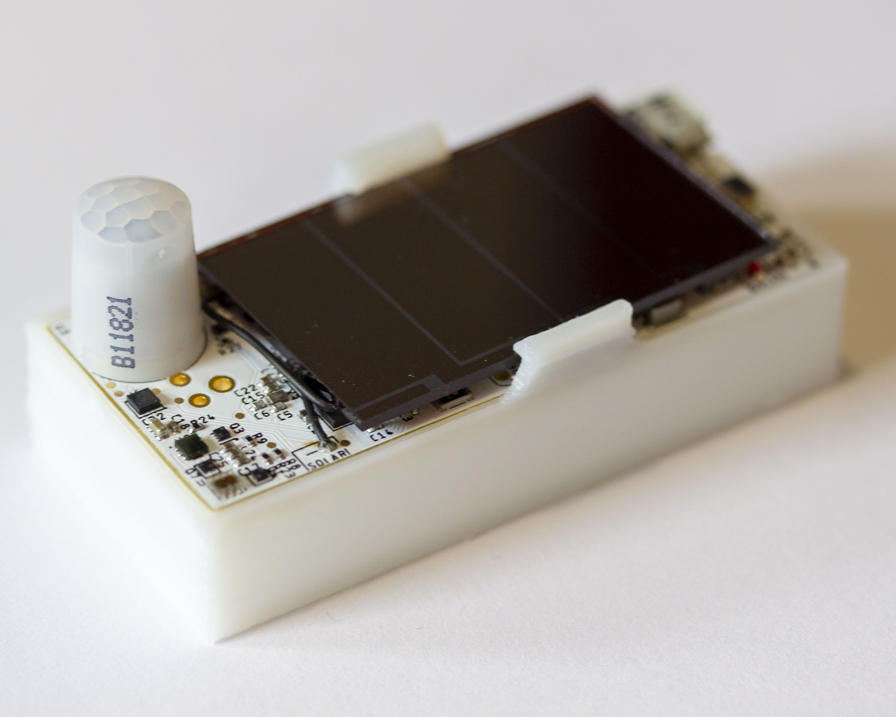

Permamote
=========

An energy harvesting sensor mote with backing primary store and a lifetime of ≥10 years.
Permamote monitors temperature, humidity, pressure, light, light color, motion
(both PIR and with an accelerometer) and reports readings over BLE and
802.15.4/Thread.

Hardware
--------
The Permamote hardware is a small, 1 x 2.4 inch rectangular sensor board based
on the Nordic NRF52840 SoC, and the TI BQ25505 for power supply management and
energy harvesting.  Permamote also has an onboard RTC, the AB1815. The board
currently has 6 sensors:

1. Temperature and Humidity (Si7021)
2. Temperature and Pressure (MS5637)
3. Light (MAX44009)
4. Light Color (TCS34725)
5. PIR Motion (EKMB1101111)
6. Accelerometer (LIS2DW12)

The Permamote hardware is located in the [`hardware/permamote`](https://github.com/lab11/permamote/tree/master/hardware/permamote) directory, where you can find
the Eagle design files and case files.

Software
--------
The Permamote uses software located in the
[`software`](https://github.com/lab11/permamote/tree/master/software/).
directory. Follow the directions in the [nrf5x-base
Readme](https://github.com/lab11/nrf5x-base/tree/nrf52832#flash-an-application)
to get your machine set up to build and flash a Permamote.

The primary application is
[`software/apps/permamote_coap`](https://github.com/lab11/permamote/tree/master/software/apps/permamote_coap).
This application samples the
sensors and sends its data to a server running a
[coap-gateway](https://github.com/lab11/gateway/tree/thread/software/coap-gateway-mqtt)
over IP on a [Thread](https://github.com/openthread/openthread) network with a
[border router](https://github.com/openthread/borderrouter).
See the
[tutorial](https://github.com/lab11/permamote/tree/master/tutorial) to set up
your own OpenThread network.

Cloning
-------
Submodules of this repo depend on Git LFS, so you should install that:

On mac:
```
brew install git-lfs
```
On ubuntu/debian:
```
sudo apt-get install git-lfs
```
Then:
```
git lfs install
```

To clone both this repository and the required submodules,
clone with the `--recurse-submodules` option:

```
git clone --recurse-submodules git@github.com:lab11/permamote.git
```

Otherwise, you can initialize the submodule and keep submodules up to
date by doing

```
git submodule update --init --recursive
```

