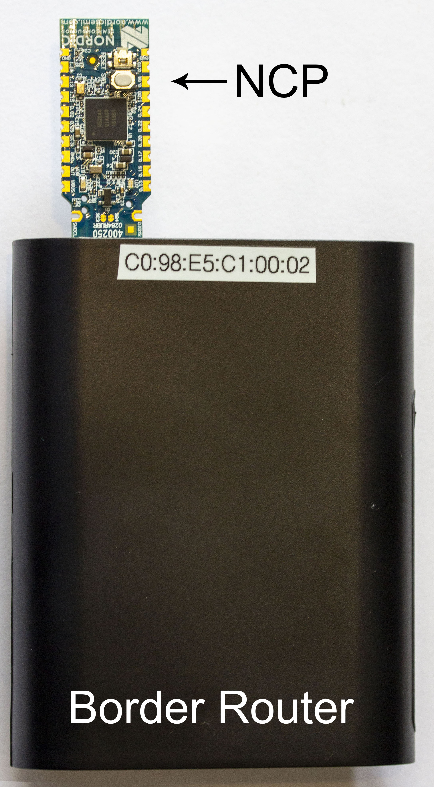
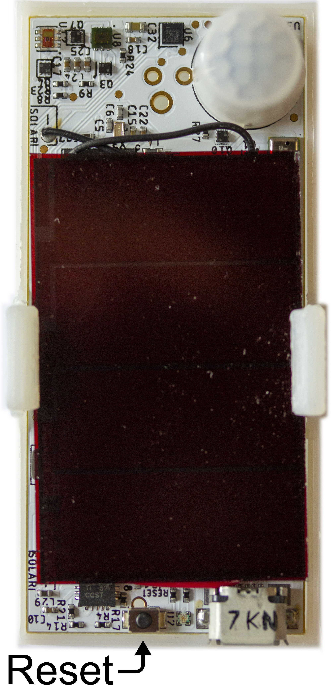

So you want to deploy some Peramamotes?
=======================================

First, you will need to deploy some infrastructure. Permamamotes currently
depend on  [Thread](https://www.threadgroup.org/What-is-Thread), a 6LoWPAN
802.15.4 mesh networking protocol. So before you deploy Permamotes, you need to
set up a Thread network. Luckily, the [OpenThread](https://openthread.io/)
project offers many open source, prebuilt parts of this network.

A Thread sensor network connected to the greater internet is minimally composed
of two devices: a [Border Router](https://github.com/openthread/borderrouter)
and a sensor. A Thread Border Router is a special type of Router in a Thread
network. In addition to performing the normal mesh routing tasks, it also
advertises itself as a gateway for traffic destined for outside the Thread
network. Other routers and devices in the network recognize this, and forward
IP datagrams pointing outside the Thread network to the Border Router. Sensors
are "Sleepy End Devices", meaning they don't participate in routing, spend most
of their time in a low power state, and just send and receive data packets.

## Border Router



So the first step towards building a network of Permamotes is to build and
deploy a Border Router. A Border Router consists of a Linux class device (e.g.
Raspberry Pi) to perform IPv6/4 routing and DNS, and a Network Co-Processor (NCP), a Thread-capable
MCU
([NRF52840
 Dongle](https://www.digikey.com/product-detail/en/nordic-semiconductor-asa/NRF52840-DONGLE/1490-1073-ND/9491124))
to interface with the Thread Network.  We also supply a prebuilt Border Router
image for an Raspberry Pi B+ and directions to set it up
[here](https://github.com/lab11/otbr).  While it is not recommended, you can
build one from scratch following the directions
[here](https://github.com/openthread/borderrouter).  When you have a working
Border Router, connect it to an Ethernet or WiFi network, and ensure you have
SSH access.

To easily SSH to a Border Router supplied by us, or built using our image, make
sure your computer and Border Router are on the same local network, and use the
`.local` MDNS hostname:
```
ssh pi@tb-c098e5c1XXXX.local
```
Where `XXXX` is the ID specific to your Border Router. If supplied by us, this
ID is printed on the case. If you built it using the directions
[here](https://github.com/lab11/otbr), you should have chosen an ID during
setup. The default password for the `pi` user on our image is `lab11otbr!`.

After successfully logging into your new Border Router, while optional, it is
good practice to **change the password**. Better yet, [disable SSH password
access](https://stackoverflow.com/questions/20898384/ssh-disable-password-authentication)
and [generate and install your public key](https://serverfault.com/questions/2429/how-do-you-setup-ssh-to-authenticate-using-keys-instead-of-a-username-password)
on the Border Router.

Next, check the status of the Border Router's Thread connection. This can be done
by checking [`wpantund`](https://github.com/openthread/wpantund), the userspace
driver to the NCP, with `wpanctl`, the command line interface to `wpantund`.
To check the status, run the following command:
```
sudo wpanctl status
```
You should get output like one of the following:
#### Unintialized
```
wpan0 => [
	"NCP:State" => "uninitialized:fault"
	"Daemon:Enabled" => true
	"NCP:Version" => ""
	"Daemon:Version" => "0.08.00d (/8e6a5cf; Dec 14 2018 00:54:48)"
	"Config:NCP:DriverName" => "spinel"
	"NCP:HardwareAddress" => [0000000000000000]
]
```
If the NCP is **uninitialized**, Ensure that the NCP USB Dongle is correctly inserted in the Border Router, and
try resetting it:
```
sudo wpanctl reset
```
or the Border Router:
```
sudo reboot
```
If this is not resolved, the NCP may be programmed incorrectly. The directions
to program can be found [here](https://github.com/lab11/otbr).
#### Offline
```
wpan0 => [
	"NCP:State" => "offline"
	"Daemon:Enabled" => true
	"NCP:Version" => "OPENTHREAD/20170716-01135-gedb7982f; NRF52840; Mar  5 2019 16:34:14"
	"Daemon:Version" => "0.08.00d (/8e6a5cf; Dec 14 2018 00:54:48)"
	"Config:NCP:DriverName" => "spinel"
	"NCP:HardwareAddress" => [9D9A0E96C4A99F45]
]
```
If the NCP is **offline**, and you just turned on the Border Router and
signed in, wait a minute or two for the boot and initialization process to
complete. If after some time the NCP is still offline, attempt to reinitialize
the network with:
```
sudo systemctl restart otbr-init
```
#### Associated
```wpan0 => [
	"NCP:State" => "associated"
	"Daemon:Enabled" => true
	"NCP:Version" => "OPENTHREAD/20170716-01135-gedb7982f; NRF52840; Mar  5 2019 16:34:14"
	"Daemon:Version" => "0.08.00d (/8e6a5cf; Dec 14 2018 00:54:48)"
	"Config:NCP:DriverName" => "spinel"
	"NCP:HardwareAddress" => [EA4923D858B4802C]
	"NCP:Channel" => 25
	"Network:NodeType" => "leader"
	"Network:Name" => "OpenThread"
	"Network:XPANID" => 0xDEAD00BEEF00CAFE
	"Network:PANID" => 0xFACE
	"IPv6:LinkLocalAddress" => "fe80::f8ad:49f4:5791:c279"
	"IPv6:MeshLocalAddress" => "fdf7:b63c:cbe7:0:76ae:2c0b:5374:1fbf"
	"IPv6:MeshLocalPrefix" => "fdf7:b63c:cbe7::/64"
	"com.nestlabs.internal:Network:AllowingJoin" => false
]
```
If the NCP is **associated**, this means the Border Router has successfully
formed (or joined) a Thread network. Congratulations!

Three parameters minimally define a Thread network: the 802.15.4 Channel, the
PAN ID, and the Master Key.  If you would like to change these network
parameters, edit `~/otbr/software/otbr-init ` to change them.
Reset the init service to enact the changes:
```
sudo systemctl restart otbr-init
```
Note that any changes in these three parameters will make the Border Router's
Thread network incompatible with any devices using previous parameters. If you
change parameters on the Border Router, you must also change them for all
devices on your Thread network.

## Permamote



Now that we have a functioning Thread network, now it is time to
[program](https://github.com/lab11/permamote/tree/master/software/apps/permamote_coap)
(if needed) and deploy sensors. If the sensors are already flashed with the
correct software, just hit the sensor reset button to restart the sensor and
quickly join the deployed network.

To confirm that your sensors have connected to the Thread network and are
successfully having their data forwarded by the Border Router, perform a
`tcpdump` of the `wpan0` interface on the Border Router:
```
sudo tcpdump -i wpan0 -vv
```
Try covering the sensor with your hand to generate light and motion data.
You should see traffic similar to the following:
```
00:47:53.964132 IP6 (hlim 64, next-header UDP (17) payload length: 43) fd11:22::2126:e996:a4a3:6049.49153 > 64:ff9b::22da:2eb5.5683: [udp sum ok] UDP, length 35
00:47:54.571889 IP6 (hlim 64, next-header UDP (17) payload length: 49) fd11:22::2126:e996:a4a3:6049.49153 > 64:ff9b::22da:2eb5.5683: [udp sum ok] UDP, length 41
...
```
If your Thread network is configured with non-default network parameters, be
sure to [change
these](https://github.com/lab11/permamote/blob/master/software/apps/permamote_coap/main.c#L625),
and reprogram your Permamotes.

## Optional Additional Routers


If you find that you need to extend the range of your Thread network to reach a
larger deployment, you can deploy additional Thread routers. Routers are similar to the
Border Router, but only route packets within the Thread network and
essentially serve as range extenders for the Thread mesh network. See
[OpenThread
documentation](https://openthread.io/guides/thread-primer/node-roles-and-types)
for more information about node roles and types. Any Thread-capable MCU can
serve as a router, including the same NRF52840 dongles
that we use as the NCP for our Border Router. To flash an NRF52840 dongle with
thread router software, plug the dongle into your computer, hit the reset
button, and:
```
cd ../software/nrfx-base/apps/thread/thread_router/
make usb_dfu
```
This should result in a flashed router that can be plugged into any 5V USB
plug. If your thread network uses different parameters than default, make sure
to change these in [`thread_dongle/main.c`](https://github.com/lab11/nrf5x-base/blob/nrf52832/apps/thread/thread_router/main.c#L91) before programming.


